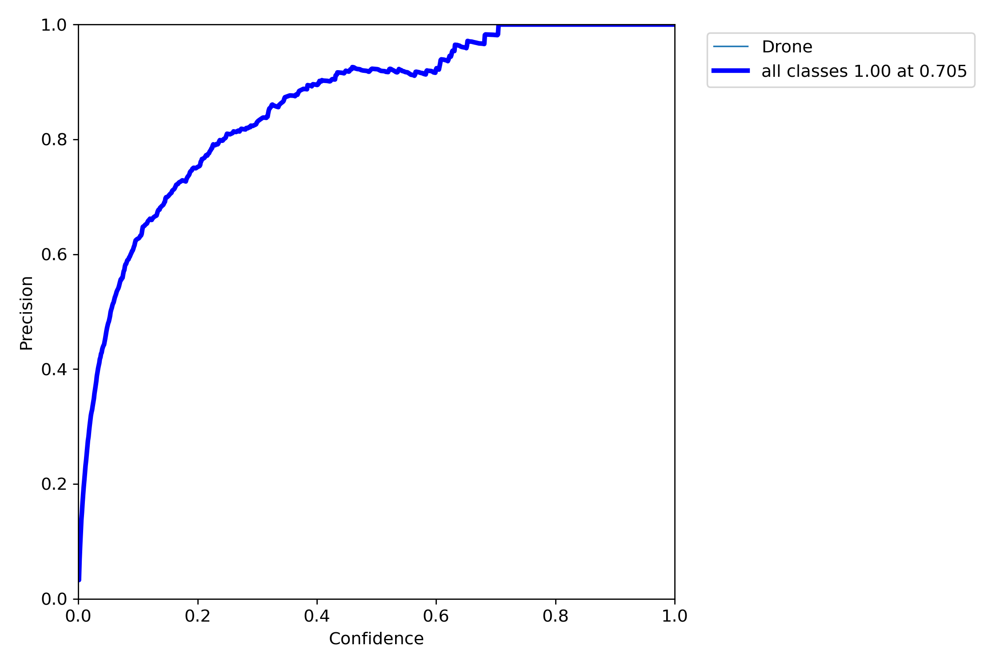
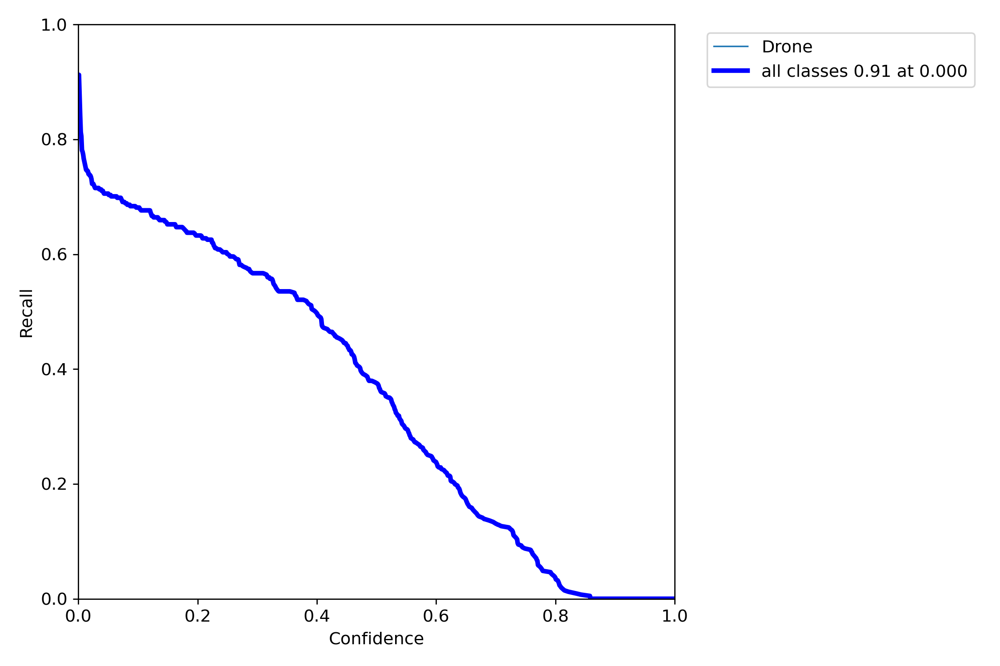
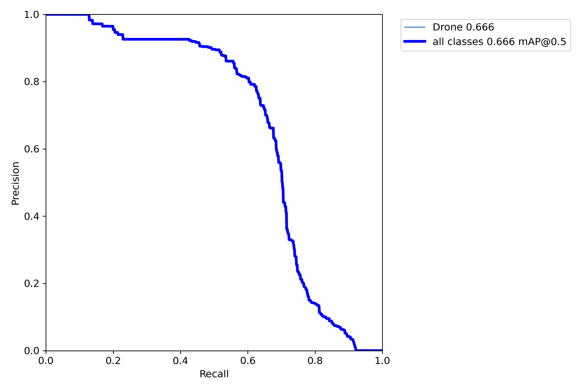
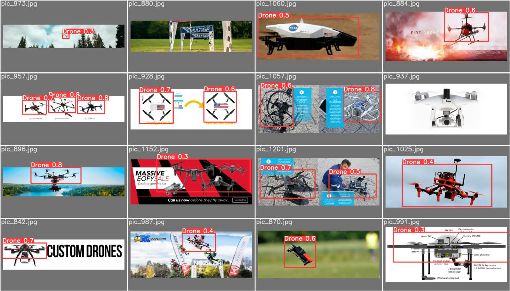

<div align="center">
<p>
<a align="left" href="https://ultralytics.com/yolov5" target="_blank">
</a>
</p>
<br>
<p>
 This drone detection system uses YOLOv5 which is a family of object detection architectures and we have trained the model on <a href="https://www.kaggle.com/dasmehdixtr/drone-dataset-uav">Drone Dataset</a>.
</p>

</div>


## <div align="center">Overview</div>


<details open>
<summary>Install</summary>

Python >= 3.6.0 required with all [requirements.txt](https://github.com/tusharsarkar3/Detect_Drone/blob/main/requirements.txt) dependencies installed:
<!-- $ sudo apt update && apt install -y libgl1-mesa-glx libsm6 libxext6 libxrender-dev -->
```bash
$ git clone https://github.com/tusharsarkar3/Detect_Drone.git
$ cd yolov5
$ pip install -r requirements.txt
```
 
 Check out <a href="https://github.com/ultralytics/yolov5">YOLOv5</a> for more information
</details>


<details>
<summary>Inference </summary>

```bash
$ python detect.py --source 0  # webcam         --weights 'path to the best set of weights'
                            file.jpg  # image 
                            file.mp4  # video
                            path/  # directory
                            path/*.jpg  # glob
                            'https://youtu.be/NUsoVlDFqZg'  # YouTube video
                            'rtsp://example.com/media.mp4'  # RTSP, RTMP, HTTP stream
```

Check out <a href="https://github.com/ultralytics/yolov5">YOLOv5</a> for more information.
</details>

<details>
<summary>Training</summary>

 The structure of the file system is of great importance here so these images will show you the correct way of organizing it. The main folder named datasets should be on the same level as this repository. The next steps are elaborated in the images: 
 
 1. The two folders with images and labels respectively should be inside the dataset folder.
 
 
 2. The images directory should contain the training images and the validation images respectively.
 

 3. The labels directory should contain the training labels and the validation labels respectively.
 
 
Run commands below to reproduce results on [Drone Dataset](https://www.kaggle.com/dasmehdixtr/drone-dataset-uav) dataset. Training times for YOLOv5s/m/l/x are 2/4/6/8 days on a single V100 (multi-GPU times faster). Use the largest `--batch-size` your GPU allows (batch sizes shown for 16 GB devices).
```bash
$ $ python train.py --img 640 --batch 16 --epochs 15 --data coco128.yaml --weights yolov5s.pt

```

 Check out <a href="https://github.com/ultralytics/yolov5">YOLOv5</a> for more information.
</details>  

---
### Results:


 




---

<h3 align="center"><b>Developed with :heart: by <a href="https://github.com/tusharsarkar3">Tushar Sarkar</a>
